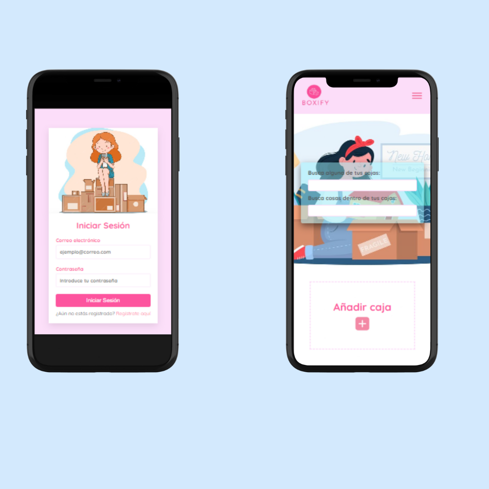

# BOXIFY

¡Organiza tu mudanza de manera sencilla! Con esta aplicación web, podrás gestionar tus cajas y objetos durante el proceso de mudanza, eliminando el estrés del desorden.



## Índice

- [Descripción](#descripción)
- [Instalación](#instalación)
- [Uso](#uso)
- [Características](#características)
- [Contribuir](#contribuir)
- [Licencia](#licencia)
- [Contacto](#contacto)

## Descripción

Boxyfy es una aplicación web diseñada para ayudarte a organizar todas las cajas y objetos durante tu mudanza. Con esta herramienta intuitiva, podrás crear, gestionar y marcar cajas, así como visualizar todo lo que has empacado de manera clara y eficiente. Aunque la parte de back-end aún está en desarrollo, puedes acceder y utilizar la versión de front-end a través del siguiente enlace:

[Boxyfy - Organiza tu mudanza](https://laura-pf.github.io/moving-organizer/#/)

## Instalación

Sigue estos pasos para instalar el proyecto en tu máquina local:

```bash
git clone https://github.com/laura-pf/moving-organizer.git
cd moving-organizer
npm install
```

## Uso

Para iniciar este proyecto debes hacerlo con:

```bash
npm run dev
```

## Características

Este proyecto incluye las siguientes características claves:

1.  **Crear y gestionar cajas de mudanza**

    - La aplicación permite a la usuaria crear cajas, nombrarlas y añadir objetos dentro de cada una.

2.  **Filtra por cajas u objetos**

    - Si tienes muchas cajas, o estas busando donde guardaste un objeto, no te preocupes, puedes filtras en el buscador que aparece en la página principal

3.  **Marcado de objetos**

    - A medida que vayas empacando, puedes marcar los objetos que ya están listos con un check, lo que facilita llevar un seguimiento.

4.  **Elimina cajas u objetos:**

    - Si cambias de opinión o cometiste un error, puedes eliminar cualquier caja o artículo en cualquier momento.

## Contribuir

Si deseas colaborar con el proyecto, sigue estos pasos:

1. Crea una nueva rama (`git checkout -b nueva-caracteristica`).
2. Realiza los cambios necesarios y haz commit (`git commit -am 'Agrega nueva característica'`).
3. Sube los cambios a tu rama (`git push origin nueva-caracteristica`).
4. Abre un Pull Request.

## Licencia

Este proyecto está bajo la Licencia MIT. Para más detalles, consulta el archivo [LICENSE](LICENSE) en este repositorio.

MIT License

## Contacto

Para cualquier consulta, sugerencia o reporte de problemas, puedes ponerte en contacto con:

- [Laura Parra](https://github.com/laura-pf)
